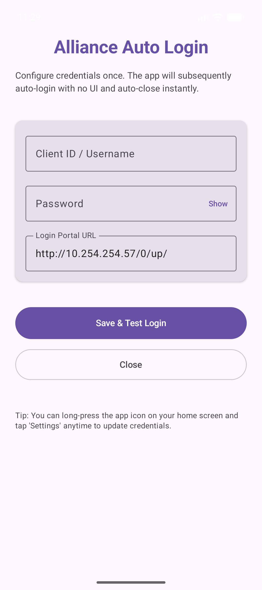
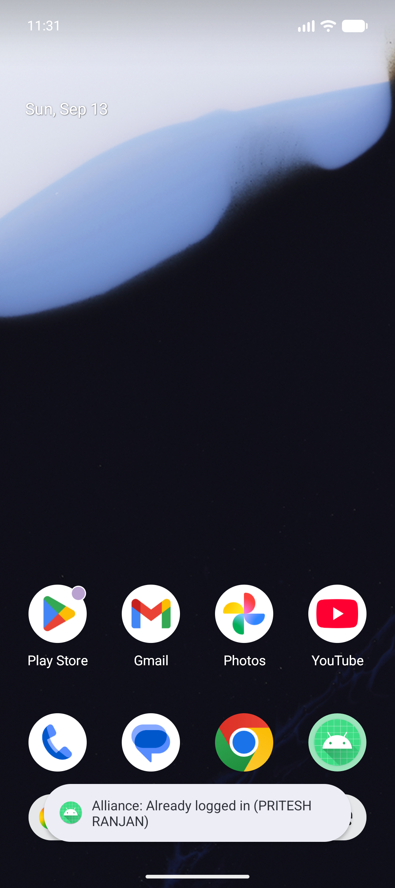
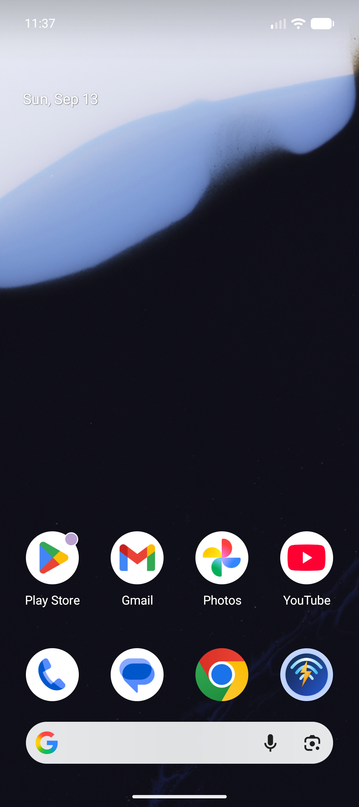

# Alliance Broadband Auto-Login for Android

[](https://kotlinlang.org)
[-3DDC84.svg?style=flat&logo=android)](https://developer.android.com)
[](https://gradle.org)
[](https://github.com/pritesh-ranjan/wifi-autologin-alliance/actions/workflows/ci.yml)
[](LICENSE)

An ultra-fast, lightweight Android application designed to authenticate with the **Alliance Broadband** captive portal (`http://10.254.254.57/0/up/`).

Once configured, opening the app triggers an automatic login in the background with **zero UI**, displays a native system Toast message with the login result, and immediately auto-closes within ~120ms.

---

## 📸 Screenshots

| Setup Screen | Zero-UI Home Screen Toast | Launcher App Icon |
| :---: | :---: | :---: |
|  |  |  |

---

## ✨ Features

- **⚡ Zero-UI & Instant Auto-Close**:
  Launches with a completely invisible, transparent floating theme (`Theme.AllianceAutoLogin.Invisible`). There is no window flicker, no activity transition, and no UI rendering. The app performs the login in the background and calls `finish()` immediately.

- **🌐 Realistic Browser Simulation (Not a Barebones curl)**:
  - **In-Memory Cookie Jar**: Preserves session cookies across requests just like a browser (`Set-Cookie`, `PHPSESSID`).
  - **Pre-flight GET Request**: Issues a GET request to `http://10.254.254.57/0/up/` with full modern mobile Chrome headers (`User-Agent`, `Accept`, `Sec-Ch-Ua`, `Sec-Fetch-*`, `Upgrade-Insecure-Requests`).
  - **Dynamic State & Token Extraction**: Checks if the user is already authenticated (avoiding duplicate logins) and parses any hidden form inputs or CSRF tokens.
  - **Form POST Submission**: Submits `user`, `pass`, `login=Login` along with `Origin` and `Referer` headers.
  - **Response Validation**: Follows HTTP redirects and parses the response HTML to confirm active subscription details (`Name`, `Expiry`, `Status`) or identify failure causes.

- **🔔 Native System Toast**:
  Flashes a clean Android Toast notification even after the activity terminates:
  - `"Alliance: Logged in (PRITESH RANJAN)"`
  - `"Alliance: Already logged in (PRITESH RANJAN)"`
  - `"Alliance Login Failed: Invalid username or password"`
  - `"Alliance: Cannot reach portal (Check Wi-Fi)"`

- **⚙️ Setup Screen & Launcher App Shortcut**:
  - **Initial Launch**: If credentials are not yet saved, the app opens a clean Jetpack Compose setup screen to input and test your Username/Client ID and Password.
  - **Subsequent Launches**: Tap app icon $\rightarrow$ Invisible auto-login $\rightarrow$ Toast $\rightarrow$ Auto-close.
  - **Change Credentials Anytime**: Long-press the app icon on your home screen and select **Settings** to open the setup screen.

- **🔒 Cleartext HTTP Whitelisting**:
  Configured with `network_security_config.xml` to explicitly allow cleartext HTTP traffic to `10.254.254.57`, ensuring full compatibility with Android 9+ (Pie through Android 16).

---

## 🏗️ Architecture & Project Structure

```
alliance_auto_login/
├── app/
│   ├── build.gradle.kts                   # App dependencies, compileSdk, minSdk
│   └── src/
│       ├── main/
│       │   ├── AndroidManifest.xml        # Permissions, headless activity & shortcut declaration
│       │   ├── java/com/example/allianceautologin/
│       │   │   ├── AllianceLoginClient.kt # Browser simulation engine (OkHttp + Coroutines)
│       │   │   ├── CredentialsStore.kt    # SharedPreferences credential persistence
│       │   │   ├── MainActivity.kt        # Zero-UI headless launcher activity
│       │   │   └── SetupActivity.kt       # Jetpack Compose settings interface
│       │   └── res/
│       │       ├── drawable/              # Vector adaptive icon foreground & background
│       │       ├── mipmap-anydpi-v26/     # Adaptive launcher icon configuration
│       │       ├── values/                # Strings, colors, and invisible theme definition
│       │       └── xml/                   # Network security config and app shortcuts
│       └── test/java/com/example/allianceautologin/
│           └── AllianceLoginClientTest.kt # Automated unit tests for HTML parser and client
├── gradle/
│   ├── libs.versions.toml                 # Version catalog
│   └── wrapper/                           # Gradle wrapper binaries
├── docs/                                  # Documentation screenshots
├── build.gradle.kts                       # Root build configuration
├── settings.gradle.kts                    # Project settings
├── .gitignore                             # Android & Gradle gitignore
├── LICENSE                                # MIT License
└── README.md
```

---

## 🛠️ Tech Stack

- **Language**: Kotlin 2.3.20
- **Networking**: OkHttp 4.12.0
- **Asynchronous Execution**: Kotlin Coroutines (`Dispatchers.IO`)
- **UI (Settings Screen)**: Jetpack Compose + Material 3
- **Build System**: Gradle 9.1.0 with Android Gradle Plugin 9.0.1
- **Minimum SDK**: Android 7.0 (API 24)
- **Target SDK**: Android 16 (API 36)

---

## 🚀 Getting Started

### Prerequisites

- **Java Development Kit (JDK)**: JDK 17, 21, or 25.
- **Android SDK**: Platforms 35 or 36 installed (or Android Studio).

### 1. Clone the Repository
```bash
git clone https://github.com/pritesh-ranjan/wifi-autologin-alliance.git
cd wifi-autologin-alliance
```

### 2. Run Automated Unit Tests
```bash
./gradlew test
```

### 3. Build the APK
```bash
./gradlew assembleDebug
```
The compiled APK will be located at:
```
app/build/outputs/apk/debug/app-debug.apk
```

### 4. Build a Signed Release APK (For Distribution)
To generate a production release APK that won't be flagged as a debug/test app:
1. Generate a release keystore (or use an existing one):
   ```bash
   keytool -genkeypair -v -keystore release.jks -alias alliance-key -keyalg RSA -keysize 2048 -validity 10000
   ```
2. Create `keystore.properties` from `keystore.properties.example`:
   ```properties
   storeFile=release.jks
   storePassword=your_keystore_password
   keyAlias=alliance-key
   keyPassword=your_key_password
   ```
3. Run the release build:
   ```bash
   ./gradlew assembleRelease
   ```
The signed release APK will be located at:
```
app/build/outputs/apk/release/app-release.apk
```

---

## 📱 Installation & Usage

### Installing via ADB
With an Android device or emulator connected via USB/Wi-Fi:
```bash
adb install -r app/build/outputs/apk/debug/app-debug.apk
```
*Alternatively, transfer `app-debug.apk` directly to your phone and tap to install.*

### First Time Setup
1. Tap the **Alliance Auto Login** app icon.
2. Enter your **Client ID / Username** and **Password**.
3. Tap **Save & Test Login** to verify connectivity with the Alliance Broadband portal.
4. Tap **Close**.

### Normal Everyday Operation
1. Connect your Android device to your home Alliance Broadband Wi-Fi network.
2. Tap the **Alliance Auto Login** app icon.
3. The app executes headlessly with **zero UI**, flashes the Toast notification with your connection status, and closes in ~120ms.

---

## 🧪 Testing

The unit test suite ([AllianceLoginClientTest.kt](app/src/test/java/com/example/allianceautologin/AllianceLoginClientTest.kt)) validates:
- Real Alliance Broadband portal HTML parsing.
- Detection of authenticated vs. unauthenticated sessions.
- Client name extraction from user info tables (`thesmalltable`).
- Dynamic hidden form token detection.
- Relative URL resolution for login actions.
- Error reason extraction from portal responses.

Run all tests via:
```bash
./gradlew test
```

---

## 🔒 Security & Privacy

This application is built with security and privacy by design:
- **Zero telemetry**: No analytics, no third-party trackers, and no external calls.
- **Strictly local**: Communicates exclusively with the local gateway portal.
- For full details, see our [Security Policy](SECURITY.md).

---

## 📄 License

This project is licensed under the [MIT License](LICENSE).
